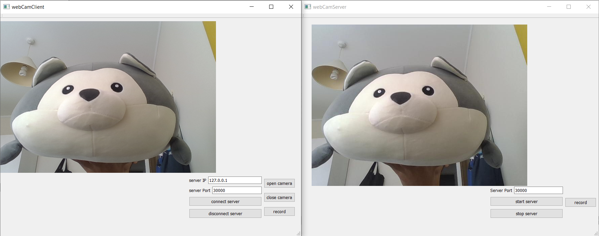

# WebCamStreamOnTCP_QT
This is a simple QT project which implements stream video captured by web camera and recording. This is a similar project with project: https://github.com/WangSL777/WebCamStreamOnTCP_Netbeans_Java, which is implemented in Netbeans platform using Java, while this project is implement in QT using C++.



## File description:
- `webCamClient` folder contains c++ source code for client. 
- `webCamServer` folder contains c++ source code for server.
- `build-webCamClient-Desktop_Qt_5_9_0_MinGW_32bit-Release\release\webCamClient.exe` is the Windows executable client file.
- `build-webCamServer-Desktop_Qt_5_9_0_MinGW_32bit-Release\release\webCamServer.exe` is the Windows executable server file.

## Task background:
```
- Create a server that received video streams over a TCP/IP. Create a UI to control that server functionality which includes start/stop & record to file.
- Create a client that capture video using web cam and send the video stream over a TCP/IP to server. Create a UI to control that client functionality which includes start/stop & record to file.
```

## How to run:
To run executable files, you need to download each release folder which contains necessary .dll files and .exe file. The recorded video files will be stored in the same directory where .exe files locates.
